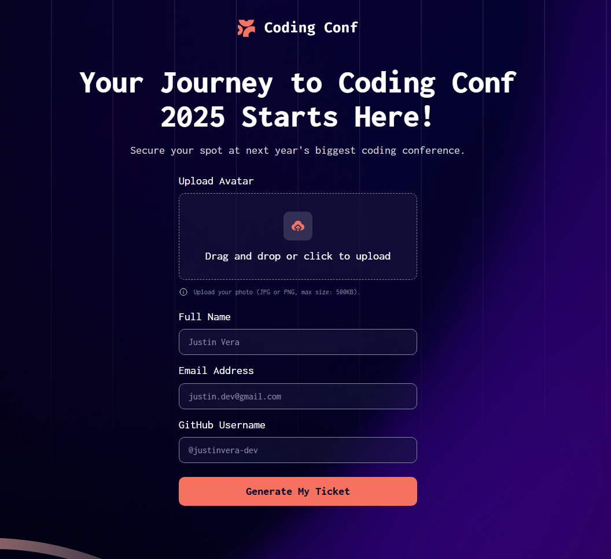

# Frontend Mentor - Conference ticket generator solution

This is a solution to the [Conference ticket generator challenge on Frontend Mentor](https://www.frontendmentor.io/challenges/conference-ticket-generator-oq5gFIU12w). Frontend Mentor challenges help you improve your coding skills by building realistic projects. 

## Table of contents

- [Frontend Mentor - Conference ticket generator solution](#frontend-mentor---conference-ticket-generator-solution)
  - [Table of contents](#table-of-contents)
  - [Overview](#overview)
    - [The challenge](#the-challenge)
    - [Screenshot](#screenshot)
    - [Links](#links)
  - [My process](#my-process)
    - [What I learned](#what-i-learned)
    - [Continued development](#continued-development)
  - [Author](#author)
  - [Acknowledgments](#acknowledgments)

## Overview

### The challenge

Users should be able to:

- Complete the form with their details
- Receive form validation messages if:
  - Any field is missed
  - The email address is not formatted correctly
  - The avatar upload is too big or the wrong image format
- Complete the form only using their keyboard
- Have inputs, form field hints, and error messages announced on their screen reader
- See the generated conference ticket when they successfully submit the form
- View the optimal layout for the interface depending on their device's screen size
- See hover and focus states for all interactive elements on the page

### Screenshot

### Links

- Solution URL: [Vercel](https://conference-ticket-generator-rust.vercel.app/)
- Live Site URL: [GitHub](https://github.com/justinvera-dev/conference-ticket-generator)

## My process

### What I learned

I learned countless lessons on this project but my favourite was learning how to add the drag and drop functionality and all the JavaScript that went into it.

This YouTube [video](https://www.youtube.com/watch?v=9Xh_ZpFkROI) + MDN + ChatGPT is what helped me create it conceptually without looking at the code too much.

### Continued development

I want to eventually fix the responsiveness because I feel like I am setting things way too rigidly.

## Author

- GitHub - [GitHub](https://github.com/justinvera-dev/conference-ticket-generator)
- Frontend Mentor - [@justinvera-dev](https://www.frontendmentor.io/profile/justinvera-dev)

## Acknowledgments

my girlfrandddd <3
